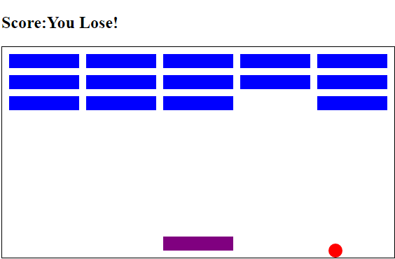

# Breakout Game with JavaScript

## Introduction

Welcome to the Breakout Game! This classic arcade game is built using JavaScript, HTML, and CSS. Control the paddle, bounce the ball, and break through the bricks to achieve the highest score. 

## Features

- 🏓 **Paddle Control**: Use the left and right arrow keys to control the paddle.
- 🧱 **Brick-Breaking**: Break all the bricks while keeping the ball from falling.
- 🎯 **Score Tracking**: Keep an eye on your score as you progress.
- 🚀 **Dynamic Ball Physics**: Experience realistic ball movement.
- ⚡ **Endless Fun**: Compete for the highest score in this timeless arcade game.

## How to Play

1. Clone this repository to your local machine.
2. Open the `index.html` file in your web browser.
3. Use the left and right arrow keys to move the paddle.
4. Break as many bricks as possible and aim for a high score!

## Screenshots

## Demo

Check out the live demo of the game here: file:///C:/Users/user/Desktop/Free-code-camp-js-7Games/Breakout-JS/index.html

## Contributing

Contributions and bug reports are welcome! Feel free to fork this repository and submit pull requests.

Enjoy the game and happy brick-breaking!
